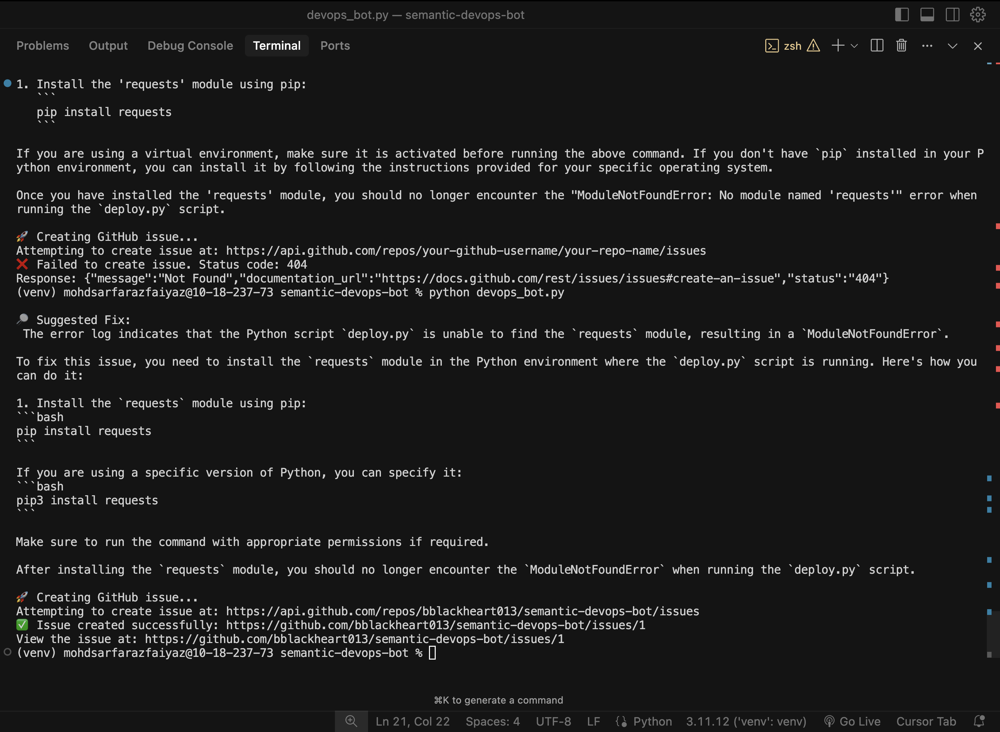

<p align="center">
  
</p>

# Semantic DevOps Bot 🚀

A next-generation AI DevOps assistant that intelligently analyzes error logs, recommends precise fixes, and can file GitHub issues on your behalf — now supercharged with **Microsoft AutoGen** for seamless multi-agent collaboration.

> Smarter logs. Faster fixes. Zero manual triage.

---

## ✨ Key Features

- 🔍 **AI-Powered Log Analysis**: Detects and interprets common build, deployment, and cloud errors using OpenAI GPT-4.
- 🧠 **Multi-Agent Collaboration**: Uses AutoGen to coordinate multiple specialized agents (Build, Deployment, Azure).
- 🔧 **Intelligent Routing**: The Coordinator agent delegates log analysis to the right expert agent based on context.
- 📂 **Error-to-Issue Automation**: Automatically generates GitHub issues with fix suggestions.
- 🌐 **Environment-Aware**: Integrates with `.env` for secure API/secret management.
- 📊 **Log + Fix Archiving**: Saves all analyzed logs and messages in `/conversations` for traceability.

---

## 🛠️ Tech Stack

- Python 3.11
- Microsoft AutoGen (Multi-Agent Framework)
- OpenAI GPT-4
- PyGithub (GitHub API)
- dotenv

---

## 🚀 Getting Started

### 1. Prerequisites

- Python 3.10 or above
- OpenAI API key
- GitHub Personal Access Token (with `repo` scope)

---

### 2. Installation

```bash
# Clone the repository
git clone https://github.com/bblackheart013/semantic-devops-bot.git
cd semantic-devops-bot

# Create a virtual environment
python3 -m venv venv
source venv/bin/activate  # (on Windows: venv\Scripts\activate)

# Install dependencies
pip install -r requirements.txt


### 3. Environment Setup

```bash
# Create a .env file in the root folder (or use the existing template):

OPENAI_API_KEY=your_openai_api_key
GITHUB_TOKEN=your_github_token
GITHUB_REPO_OWNER=your_github_username
GITHUB_REPO_NAME=semantic-devops-bot
```

### 4. Usage

```bash
#Analyze a single log message via command line:
python main.py --log-text "ModuleNotFoundError: No module named 'requests'"
```

The system will:
- Analyze the error log
- Suggest a fix
- (Optionally) Auto-create a GitHub issue with the error details and fix.

---

## Agents & Architecture

```
semantic-devops-bot/
├── agents/                  # Coordinator and specialist AI agents
│   ├── coordinator_agent.py
│   ├── analyzer_agent.py
│   ├── build_error_agent.py
│   ├── deployment_agent.py
│   └── azure_optimizer_agent.py
├── tools/                   # GitHub issue creation tool
├── services/                # API wrappers
├── plugins/                 # Future integrations
├── conversations/           # Saved multi-agent analysis logs
├── logs/                    # Input error logs
├── main.py                  # Main CLI entrypoint
├── .env                     # API and GitHub credentials
├── .gitignore
└── requirements.txt

```
## 📸 Example Output
```
📌 Final Analysis Response:

ERROR SUMMARY:
ModuleNotFoundError: No module named 'requests'

ROOT CAUSE:
The required Python package 'requests' is missing in the current environment.

RECOMMENDED FIX:
Run: pip install requests

PREVENTION:
Add it to your requirements.txt file to ensure future environments include it.
```
## 🧪 Sample Commands

```
# Example Docker error
python main.py --log-text "pull access denied for myapp/image, repository does not exist"

# Example Azure deployment error
python main.py --log-text "DeploymentFailed: Resource group 'my-group' could not be found"
```

## 🎯 Future Plans

- ✅ Multi-agent collaboration (triage, refund, billing agents)
- ✅ Automated CI/CD failure diagnosis and patch suggestions
- ✅ Azure DevOps integration for auto-scaling and optimization
- ✅ Slack / Teams bot integration
- ✅ Web App Frontend (log upload → instant AI analysis)

## 📜 License

This project is licensed under the MIT License.

## 🙏 Acknowledgements

- [AutoGen (by Microsoft)]([https://docs.github.com/en/rest](https://github.com/microsoft/autogen))
- [Microsoft Semantic Kernel](https://github.com/microsoft/semantic-kernel)
- [OpenAI API](https://platform.openai.com/docs/api-reference)
- [GitHub API](https://docs.github.com/en/rest)

## 📣 Connect with me!

- [GitHub](https://github.com/bblackheart013)
- [Google Scholar](https://scholar.google.com/citations?user=o1hrV0kAAAAJ&hl=en)
- [LinkedIn](https://www.linkedin.com/in/mohd-sarfaraz-f-8bb52922a) 

If you find this project interesting or valuable, feel free to connect or collaborate.

Built with 💻 and ❤️ for making DevOps smarter.

semantic kernel, microsoft semantic kernel, openai api, devops automation, github issue bot, AI error analysis, error log analyzer, multi-agent systems, AI DevOps tools, python semantic kernel, devops bot, github automation, azure optimization, ci/cd failure diagnosis

---
